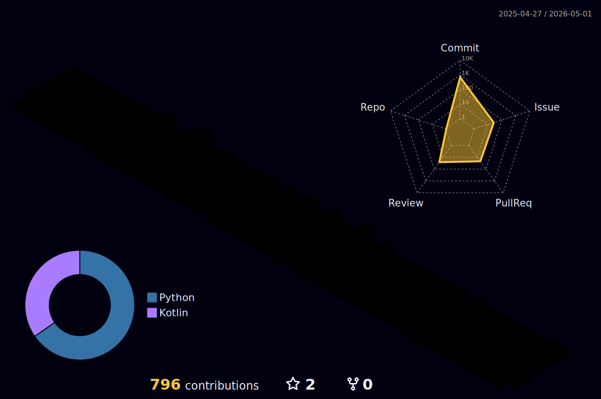

# 인공지능에 가치를 느끼는 안드로이드 개발자 정현석입니다. 👋
다양한 문제상황에서 해결사로 활동할 수 있는 엔지니어가 되는것을 목표로 공부하고 있습니다.  
주 관심분야는 안드로이드 네이티브이며  
현재는 AI, ComputerVision 을 공부중입니다.   
 
 

## ⚔ SKILL ⚔

  

        
        
        
           
        
        
        
           
        
        
        
        
    
  

  

    
  

<table>
  <tr>
    <td style="width: 50%; padding-right: 20px;">
      
        
        
           
        
        
        
           
        
        
        
        
    </td>
    <td style="width: 50%; padding-left: 20px;">
      
      </td>
  </tr>
</table>

  

<!--

-->

### 운영중인 블로그 (Velog Stats)
  

