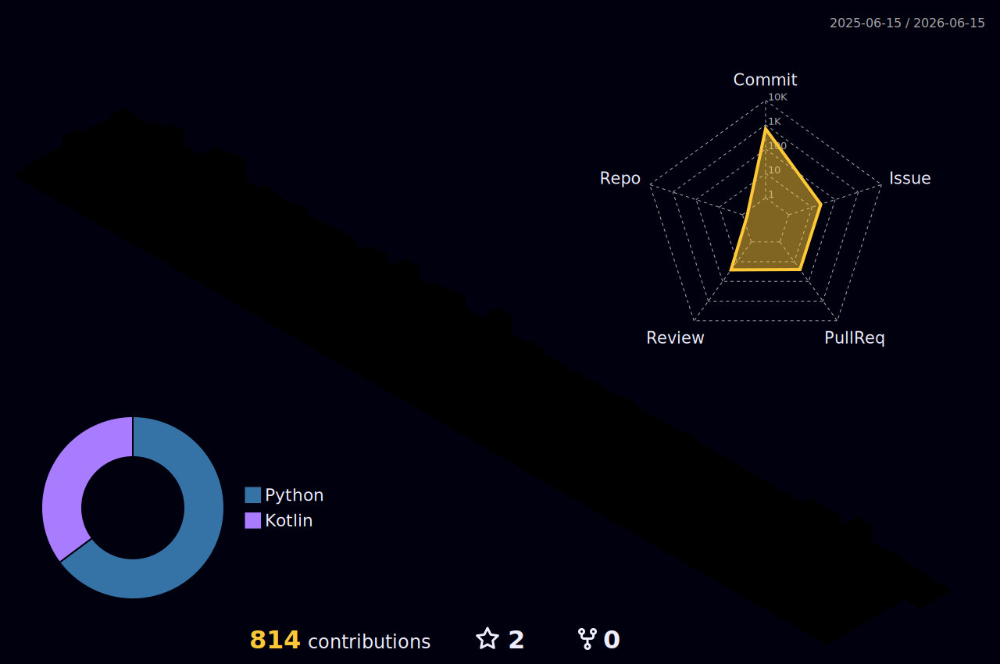

# 안녕하세요 최적화를 고민하는 안드로이드 개발자 정현석 입니다.  
안정적인 서비스 개발은 결국 유저 데이터와 디바이스 자원 활용에 달려 있습니다.  
최적화에 대한 끊임없는 고민으로 서비스에 기여하고 싶습니다.
 
 

## ⚔ SKILL ⚔
<table style="table-layout: fixed">
  <tr>
    <td>
      
    </td>
    <td style="width: 400px;">
      
        
        
          
        
        
        
          
        
        
        
        
      </td>
  </tr>
</table>

## 운영중인 블로그
  
 - [2026-4-23 : 객체지향에서 현대 클린아키텍처 까지](https://renovatio-dev-hyuns.tistory.com/15)
  
 - [2025-8-20 : 네트워크 요청을 안전하게 해보자 (feat. Template Method Pattern)](https://renovatio-dev-hyuns.tistory.com/14)
  
 - [2025-8-13 : [자료구조] 트라이(Trie)](https://renovatio-dev-hyuns.tistory.com/13)
  
 - [2025-6-17 : [ScratchRevealCard] 3. Modifier의 그래픽 수정자 - drawScope, graphicsLayer](https://renovatio-dev-hyuns.tistory.com/12)
  
 - [2025-5-30 : [ScratchRevealCard] 2. 그림판 구현으로 기술적 검증을 해보자.](https://renovatio-dev-hyuns.tistory.com/11)
  
<!--
  

-->

## 📊 Github Stats 📊

