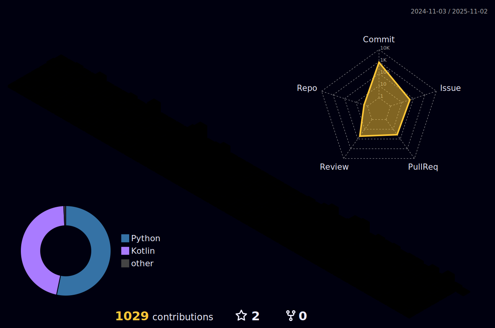

# 인공지능에 가치를 느끼는 안드로이드 개발자 정현석입니다. 👋
다양한 문제상황에서 해결사로 활동할 수 있는 엔지니어가 되는것을 목표로 공부하고 있습니다.  
주 관심분야는 안드로이드 네이티브이며  
현재는 AI, ComputerVision 을 공부중입니다.   

<!--
**hyuns66/hyuns66** is a ✨ _special_ ✨ repository because its `README.md` (this file) appears on your GitHub profile.

Here are some ideas to get you started:

- 🔭 I’m currently working on ...
- 🌱 I’m currently learning ...
- 👯 I’m looking to collaborate on ...
- 🤔 I’m looking for help with ...
- 💬 Ask me about ...
- 📫 How to reach me: ...
- 😄 Pronouns: ...
- ⚡ Fun fact: ...
-->

  

### 운영중인 블로그 (Velog Stats)
  

